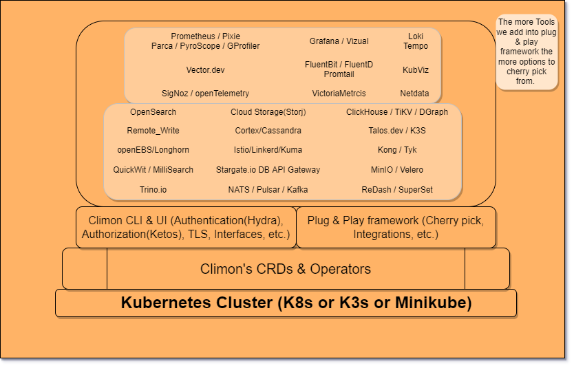

# Climon (Soi) 
##### Democratizing Administration, Orchestration, Monitoring & Observability technology for cloud-native environment. 
Distributed monitoring solution for cloud-native with Authentication, Authorization, TLS, Users, Roles, Groups and Tenant management, Interfaces to setup & visualize alerts, Self-Healing, Self-Operating, Workload Autoscaling, Cluster Autoscaling and more using Prometheus, KubViz, Git-Bridge, SigRun, Vizual.App, CoSign, Grafana, Loki, Promtail, FluentBit, FluentD, Vector.dev, Tempo, SigNoz, Jaeger Tracing, Operator SDK, Cortex, Pixie, Parca, PyroScope, GProfiler, Metrics-Server, Horizontal Pod Autoscaler (HPA), Vertical Pod Autoscaler (VPA), Cluster Proportional Autoscaler (CPA), Cluster Autoscaler (CA), Karpenter.sh, Prometheus Operator, Prometheus Alert Manager, VictoriaMetrics, Netdata, EFK, OpenSearch, QuickWit, MilliSearch, Trino.io, Cloud Providers' Storage, PostgreSQL, Cassandra, ClickHouse, TiKV, TiDB, YugaByte, KubeDB, DGraph, Vitess MySQL, Stargate.io, Storj, minIO, Velero, openEBS, Longhorn, Rancher, TalOS, K3s, Lens, Vault, Cert-Manager, Sealed-Secrets, External-Secrets, bank-vaults, vault-operator, Kyverno, Sysdig, Falco, KubeScape, Kube-Linter, Trivy, Tracee, Anchore, Syft, Grype, Pluto, RBAC-Manager, RBAC-Lookup, Reckonar, Nova for helm-charts, VaultUtil, Polaris, GoldiLocks, Datadog, Opstrace, Log-Operator, Pulumi, Terraform, Terragate, TerraScan, Crossplane, Tekton, Gitlab, Gitea, Harbor, OperatorHub, ArgoCD, Argo Rollouts, Argo Workflows, Argo Events, Kpten, OPEN API, CloudEvents.io, GitOps-Engine, FluxCD, Flagger, getUnLeash.io, TestKube, TestTrace, K6, Kuma, Istio, Linkerd, Kong API gateway, Tyk API gateway, OIDC, oAuth2, SAML Keycloak, SSO, MFA, Dex OIDC for K8s, Hydra, Ketos, Kratos, OathKeeper, Open Policy Agent (OPA), GateKeeper, OPAL.ac (open policy agent admin console), Cerbos, Ory.sh, WorkOS, Okta, NATS, Kafka, Pulsar, AirByte, KubeFlow, Feast.dev, MLFlow, ZenML, PlanetScale, DataStax, CurnchyData, FaunaDB, DataBricks, SnowFlake, CloudQuery, StreamPipe, AWS, Azure, GCP, CIVO, Linode, Heroku, DigitalOcean, IntelOps.ai, Tarian.ai, Compage.dev, Optimizor, Slack, MS Teams, BotKube, Mattermost, Email Notifications, Temporal.io, getConvoy.io, Rust, GoLang, Flutter, React, Deno, WebAssembly, etc. 

End-Users can cherry pick to build their favorite Monitoring Stack and maintain the stack easily. 

Yes, this will remain 100% open-source and driven by open-source community. 

#### What's with the name:
Click Monitoring -> 1st three letters of both the words = CliMon (Climon). 
And when we saw the meaning for the person name Climon we like it when we translate the meaning into technology relevant meaning. 
Here is the reference, [CliMon name](https://www.babynology.com/name/climon-m.html). 
Soi - French word, meaning "self". Opt for self-service framework. 

### Framework:
Plug & Play is the main principle of Climon's design. 
Climon's K8s CRDs & Operators are used to create, install, patch, update, upgrade and do operations management of CliMon. 
You need K8s cluster to run Climon. 
Climon's CRDs & Operators uses the operators/helm charts/yaml-files of the tools which users cherry pick to setup their favorite monitoring stack. 
The Main purpose of Climon's CRDs & Operators is to make sure all the deployed tools are having automated https URLs and self-healing enabled and to configure Alerts & dashboards for the cherry picked tools via Climon's UI. 

### Architecture:

